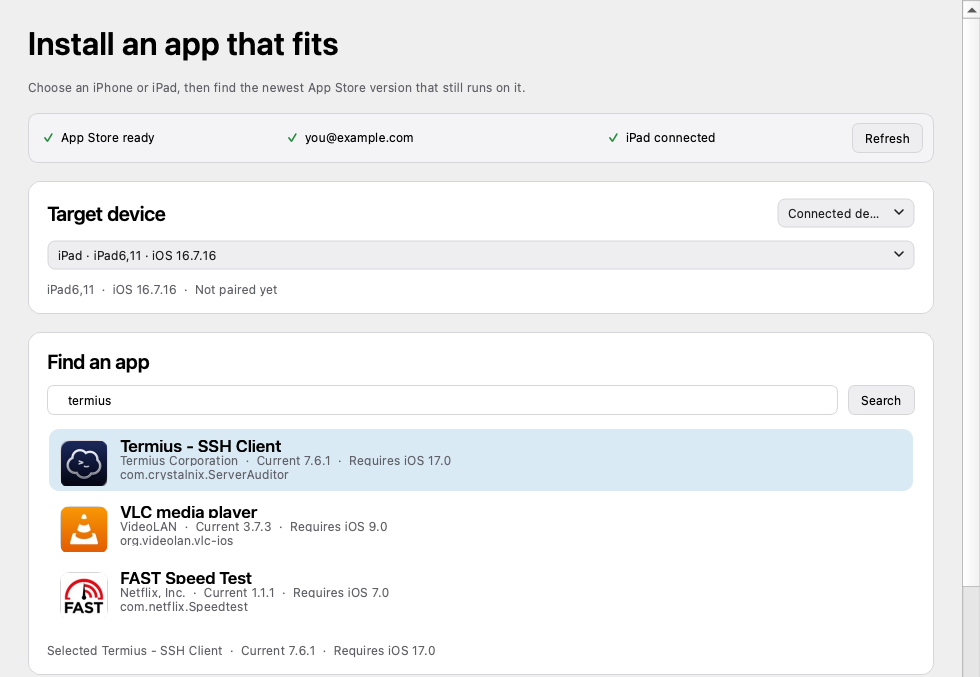
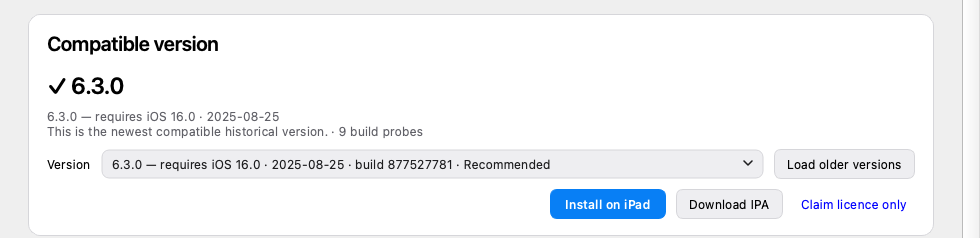

# appfit

Find and install the newest App Store version that still works on an older
iPhone or iPad.

When an app's current release requires a newer iOS version, a compatible build
may still exist in its App Store history. appfit finds that build, verifies that
it fits the target device, and can download or install it using the Apple ID
that owns the app.

## Choose how you want to use it

There are two things to decide: whether you want a window or a terminal, and
whether the device is plugged in.

| | **Mac app** | **Terminal** |
|---|---|---|
| **Cable attached** | appfit reads the connected device's iOS version, recommends the newest compatible build, then downloads, verifies, and installs it over USB. | The same, driven by `appfit install`. |
| **No cable** | Type the iOS version and device family by hand to compare compatible builds, claim the free licence, or download the IPA. | `appfit get` claims the licence; the device then requests Apple's compatible version itself. |

The Mac app is the shortest path and needs nothing else installed. The terminal
suits scripting and repeated runs.

## Install the Mac app

1. Download `appfit-<version>-arm64.dmg` (Apple silicon) or
   `appfit-<version>-x86_64.dmg` (Intel) from
   [GitHub Releases](https://github.com/BnS2/appfit/releases).
2. Open the disk image and drag **appfit** to **Applications**.
3. appfit is not notarized by Apple. On first launch, right-click the app and
   choose **Open**, then **Open** again. If macOS still refuses, allow it once
   under **System Settings → Privacy & Security**. Later launches are normal
   double-clicks.

That is the whole install. The App Store helper travels inside the app, so
Python and Go are not required.

## Install for the terminal

Requires macOS, Python 3.10 or newer, and Go, which builds appfit's App Store
helper.

```bash
brew install go
mkdir -p "$HOME/appfit"
cd "$HOME/appfit"
python3 -m venv .venv
source .venv/bin/activate
```

Download `appfit-0.3.1-py3-none-any.whl` from
[GitHub Releases](https://github.com/BnS2/appfit/releases), then install it.
Include the `device` extra for USB installation:

```bash
pip install "$HOME/Downloads/appfit-0.3.1-py3-none-any.whl[device]"
appfit ipatool install
```

Without USB installation, install the wheel with no extra. To run the same GUI
from a terminal environment, use the `gui` extra and the `appfit-gui` command.

When returning later, reactivate the environment:

```bash
cd "$HOME/appfit"
source .venv/bin/activate
```

## Use the Mac app

1. Open appfit.
2. Select the connected device, or switch to a manual iOS version and device
   family.
3. Search for an app and select the correct result.

   

4. Choose **Find newest compatible version** and confirm the Apple ID action.
5. Install over USB, download the IPA, or show the licence-only instructions.

   

Older compatible builds can be loaded after the recommendation. Password and
two-factor prompts open in a separate Terminal window; appfit does not receive
or store those secrets.

## Use the terminal with a cable

Sign in, connect and trust the device, then list it:

```bash
appfit accounts use you@example.com
appfit devices
```

Pair its UDID with the Apple ID currently used for App Store purchases on that
device:

```bash
appfit pair <udid> --account you@example.com
```

Install the newest compatible build:

```bash
appfit install <bundle-id> --device <udid>
```

To stop before installation:

```bash
appfit resolve <bundle-id> --device <udid>
appfit download <bundle-id> --device <udid>
```

Search first if you do not know the bundle ID:

```bash
appfit search "app name"
```

## Use the terminal without a cable

Apple performs the download on the device itself. Sign in, then claim the free
app licence for the target iOS version:

```bash
appfit accounts use you@example.com
appfit get <bundle-id> --ios 16.7.16 --platform ipad
```

appfit prints the Purchased-tab steps. Apple decides whether an older version is
offered on the device.

## Command reference

| Command | Purpose |
|---|---|
| `appfit search <query>` | Find an App Store app. |
| `appfit accounts use <email>` | Sign in through ipatool. |
| `appfit devices` | List connected devices and iOS versions. |
| `appfit get <app> --ios <version>` | Claim a free licence and show on-device steps. |
| `appfit resolve <app> --device <udid>` | Find the newest compatible build. |
| `appfit download <app> --device <udid>` | Download and verify the selected IPA. |
| `appfit install <app> --device <udid>` | Install the selected IPA over USB. |
| `appfit cache list` | Show cached resolutions and downloads. |
| `appfit cache prune` | Preview cleanup of unreferenced IPA files. |
| `appfit ipatool status` | Show the selected ipatool helper. |

`<app>` can be a bundle ID, numeric App Store ID, App Store URL, or search term.
Use an exact identifier before any licence-changing action.

## What you need on the device

- The Apple ID used for App Store purchases on the target device.
- For USB installation: an unlocked, connected, and trusted iPhone or iPad.

## Safety and limits

- appfit uses intact, encrypted App Store IPAs. It does not decrypt apps or
  bypass FairPlay.
- Device installation stops if the active Apple ID does not match the account
  paired to that device.
- Apple controls app availability, licence eligibility, regions, retained
  historical builds, and its on-device compatible-version offer.
- Apple sometimes declines to serve an app's newest release. appfit reports this
  and recovers from a build it has already recorded; an app it has not resolved
  before stays unavailable until Apple serves that release or the app ships
  another.
- Compatibility checks cover declared iOS and device-family requirements, not
  every hardware, server-side, or account restriction.
- appfit cannot make third-party IPA downloads safe or account-compatible.

appfit uses Apple's public search API, ipatool, and pymobiledevice3. It is
independent and is not affiliated with or endorsed by Apple Inc.

## Cache and privacy

Build metadata and downloaded IPAs are stored under `~/.config/appfit/` and are
reused when possible. Cleanup is dry-run-first:

```bash
appfit cache prune
appfit cache prune --yes
```

Exported cache metadata contains no password or App Store session, but it can
include app bundle IDs and target iOS versions. Review it before sharing.

## Project information

- [Release history](CHANGELOG.md)
- [Security policy](SECURITY.md)
- [Contributing](CONTRIBUTING.md)
- [MIT License](LICENSE)

appfit is not currently published on PyPI.
